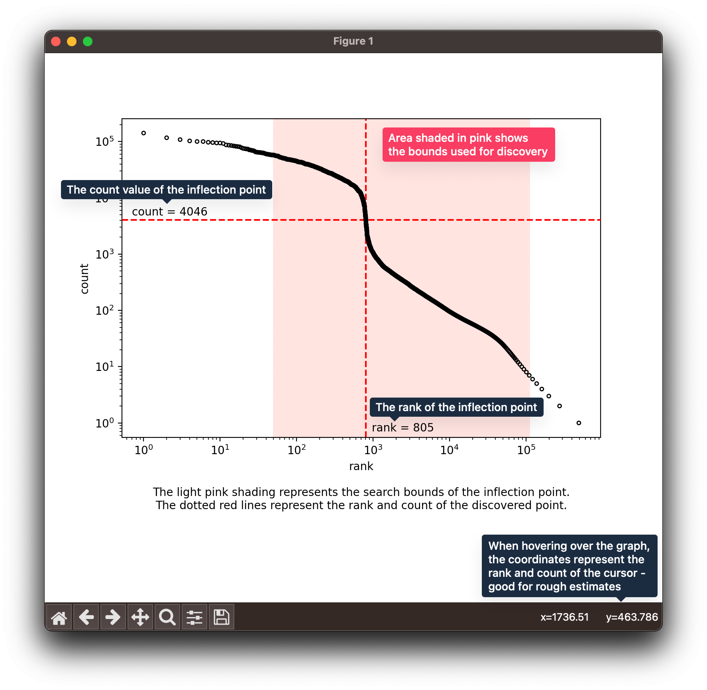

# Usage

**Table of Contents**
- [Arguments](#arguments)
- [Installation](#installation)
- [Autopilot](#autopilot)
  - [Inflection point discovery, no whitelist](#inflection-point-discovery-no-whitelist)
  - [Whitelist filtering, no inflection point discovery](#whitelist-filtering-no-inflection-point-discovery)
  - [Whitelist filtering and inflection point discovery](#whitelist-filtering-and-inflection-point-discovery)
- [Manual method](#manual-method)
  - [Setting a minimum and maximum rank for inflection point searching](#setting-a-minimum-and-maximum-rank-for-inflection-point-searching)
  - [Using a predetermined rank/inflection point](#using-a-predetermined-rankinflection-point)
  - [Listing more potential inflection points](#listing-more-potential-inflection-points)
  - [Graphing the barcodes visually](#graphing-the-barcodes-visually)


## Arguments
```
usage: filter-barcodes.py [-h] [-v] [-o <file>] [--dry-run] [--no-inflection]
                          [-l <r>] [-u <r>] [-g] [--list-points <n>]
                          [--use-predetermined-rank <r>] [-w <file>]
                          [filename]

finds the inflection point when demultiplexing using flexiplex

positional arguments:
  filename              input file, typically called
                        flexiplex_barcodes_counts.txt. defaults to stdin if
                        not given

options:
  -h, --help            show this help message and exit
  -v, --verbose         output verbose and debugging information, and also
                        display more potential inflection points
  -o <file>, --outfile <file>
                        output file, defaults to stdout if not given (ignored
                        if --dry-run is active)
  --dry-run             only output discovered inflection points, without
                        performing the actual filtering

filter by inflection point:
  --no-inflection       do not search for an inflection point
  -l <r>, --min-rank <r>
                        lowest rank to search
  -u <r>, --max-rank <r>
                        highest rank to search

fine-tune/visualise an inflection point:
  -g, --graph           show a graph with the inflection point marked,
                        requires matplotlib. will also enable --dry-run.
  --list-points <n>     show multiple potential points. will also enable
                        --dry-run.
  --use-predetermined-rank <r>
                        use predetermined inflection point. this will disable
                        searching, but will still filter for all ranks <= r

filter by whitelist file:
  -w <file>, --whitelist <file>
                        a whitelist file for known chemistry barcodes. if not
                        given, this program will not perform whitelist
                        filtering.
```

## Installation
The script is designed to be minimal and depends on only `numpy` and `pandas`. `matplotlib` is optional, and is used for the graphing functionality.

```bash
$ wget -O https://github.com/DavidsonGroup/flexiplex/blob/filters/scripts/filter-barcodes.py
$ python filter_barcodes.py
```

or even, to avoid downloading,

```bash
$ curl https://github.com/DavidsonGroup/flexiplex/blob/filters/scripts/filter-barcodes.py | python -
```

A `requirements.txt` is provided as well for reproducibility: `pip install -r requirements.txt` or `conda install --file requirements.txt`.

## Autopilot
This script has sensible defaults which can automatically find an 'approximate' inflection point and perform whitelist filtering for you. It will never edit your files in-place and will always output to `stdout` or a given output file.

Usually, runtime and resource usage is minimal so the script is suitable for use in interactive environments.

The `--outfile` command specifies an output file for the final barcodes to be written to. If not given, they will be printed to `stdout` and can be redirected into a file or program of your choice. The output file is the same format as `flexiplex_barcodes_counts.txt` and therefore can be immediately passed directly to `flexiplex` for demultiplexing.

### Inflection point discovery, no whitelist
Inflection point discovery is enabled by default. No special parameters are required. This will write a filtered list of barcodes and counts (in the same format as `flexiplex_barcodes_counts.txt`) directly to the output file.

This automatic inflection will, by default, use:
* Lower bound (smallest rank to be searched): 50
* Upper bound (highest rank to be searched): the 95th percentile by count value

These can be overriden using the `-l` and `-u` parameters, if your dataset is small or needs fine-tuning.

```bash
$ python filter_barcodes.py --outfile output.txt flexiplex_barcodes_counts.txt

Rank of inflection point: 182
```

### Whitelist filtering, no inflection point discovery
> **⚠️ Note**
> At the moment, the whitelist filtering does not support a gzipped file. It is recommended to first unzip and then pass into this script. There is no support for reading whitelist files from stdin.

The `--whitelist <file>` argument will read a plaintext file of newline-separated barcodes, such as a 10x barcode whitelist, which will be used as a filter for the input file. Any barcodes in the input file, which are not contained within this whitelist file, will be discarded.

As inflection point discovery is on by default, the `--no-inflection` argument should be used to disable it. This will just perform a whitelist filter.

```bash
$ python filter_barcodes.py --whitelist 3M-february-2018.txt --no-inflection --outfile output.txt flexiplex_barcodes_counts.txt

Filtered with whitelist, removed 656317 out of 766589 barcodes (85% of all barcodes)
```

Alternatively, command line tools can be used.
```bash
$ sort <(gunzip -c 3M-february-2018.txt.gz) <(cut -f1 flexiplex_barcodes_counts.txt) | uniq -d > output.txt
```


### Whitelist filtering and inflection point discovery
```bash
$ python filter_barcodes.py --whitelist 3M-february-2018.txt --outfile output.txt flexiplex_barcodes_counts.txt

Filtered with whitelist, removed 656317 out of 766589 barcodes (85% of all barcodes)
Rank of inflection point: 182
```

## Manual method
This script has tools which can help with discovery, visualisation, and filtering. A few use cases will be detailed below.

* `--dry-run`: will output the results after discovery, without outputting to a file or stdout. Can be helpful to make conclusions about the data first.
* `--verbose`: will output a little more information about what the script is doing under the hood, such as discovered bounds


### Setting a minimum and maximum rank for inflection point searching
The extremes of the data tend to be sparsely populated and not very appropriate for calculating an inflection point. Consequently, by default, this script will use a minimum rank of 50 and maximum rank equivalent to the 95th percentile of counts in order to search for an inflection point. However, this can be changed if your data behaves differently, using the `--min-rank` (`-l`) and `--max-rank` (`-u`) arguments. This can also be helpful if your data seems to have multiple inflection points.

In the below example, the corresponding count is also given. Note that the minimum rank represents the largest count, and vice versa. Thus, the barcode with rank 20 will have a count of 72575, and the barcode with rank 1000 has a count of 365. The discovered inflection point will necessarily have a rank between 20 and 1000.

```bash
$ python filter-barcodes.py -l 20 -u 1000 --verbose [...]

--list-points not given, setting it to 10
No whitelist file given, skipping
Bounds interval: ranks [20, 1000] -> counts [365, 72575]
...
```


### Using a predetermined rank/inflection point
If an optimal inflection point has already been determined, passing the `--use-predetermined-rank` $r$ argument will disable inflection point discovery and will instead filter all ranks $\leq r$.

```bash
$ python filter-barcodes.py --use-predetermined-rank 532 ...

Using predetermined rank, not initiating discovery
Rank of inflection point: 532
```


### Listing more potential inflection points
When given, `--list-points` can output other potential inflection points. The inflection point is determined by the barcode with the lowest numerical derivative
$$\frac{d\log_{10}(\text{count})}{d\log_{10}(\text{rank})}\approx \frac{\Delta\log_{10}(\text{count})}{\Delta\log_{10}(\text{rank})}$$
 after smoothing is applied (in this case, a rolling mean). 

 Observe that in the following example, there are two distinct 'neighbourhoods' which could contain an inflection point: $r \approx 805$ and $r \approx 830$. 

```
$ python filter-barcodes.py --list-points 10 ...

Setting --dry-run as --list-points was given

10 smallest derivatives:
               barcode  count  count_log10  rank_log10       diff
rank                                                             
805   GATGCTAAGCAGTACG   4046     3.607026    2.905796 -25.079053
804   ATTCCTGCACGCCACA   4117     3.614581    2.905256 -23.771129
806   TCAAGCAGTACTTCCT   4039     3.606274    2.906335 -22.406635
807   GACTCAACACGGTAGA   3892     3.590173    2.906874 -21.537877
830   CACCGTTTCGCTCCTA   2613     3.417139    2.919078 -20.176259
831   AATGAAGTCAACCCGA   2569     3.409764    2.919601 -19.989456
808   AGTTCGACACCTATCC   3807     3.580583    2.907411 -18.918672
832   ATAGAGAGTATGGAAT   2508     3.399328    2.920123 -18.751848
833   GGGAAATGTAGCGTTT   2380     3.376577    2.920645 -18.387575
834   CTACCTGTCCTGATCT   2365     3.373831    2.921166 -18.326212

Once an appropriate rank cutoff <r> has been determined, use the leftmost column (`rank`) as the parameter to:
    --use-predetermined-rank <r>
This will produce a list of all valid barcodes using the barcodes from ranks 1 to <r>.

Rank of inflection point: 805
```

### Graphing the barcodes visually
Passing the `--graph` option will create a knee plot of the ranks compared with the respective counts. Both $x$ and $y$-axes have a log10 scale. By default, it will also show the bounds used for discovery, as well as the discovered rank.

This requires a windowed environment and is not suitable for a headless computing setup.

```bash
$ python filter-barcodes.py --graph ...
[Figure 1]
```


*Figure 1: The script running with `--graph` enabled.*

Note that this can be used in conjunction with `--use-predetermined-rank` to visualise the location, rank, and count of any given barcode.